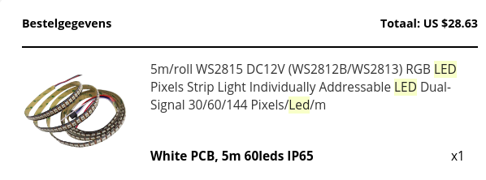
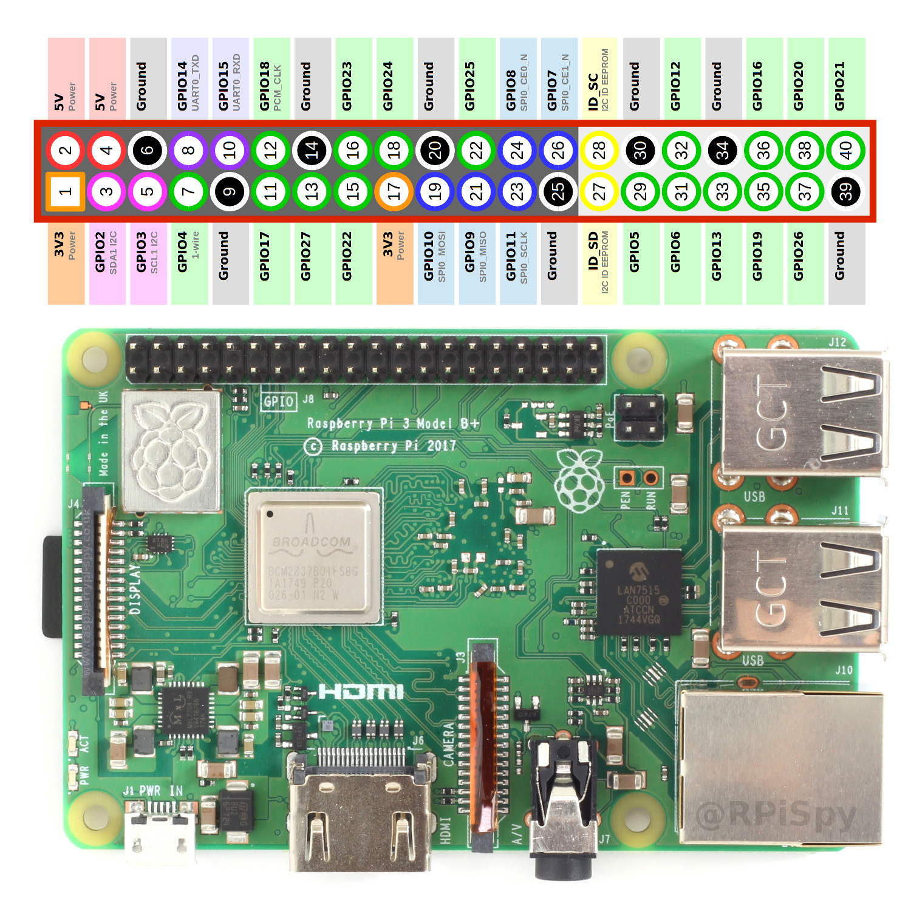

Followed tutorial:
https://tutorials-raspberrypi.com/connect-control-raspberry-pi-ws2812-rgb-led-strips/

My LEDs model type:
WS2815 DC12

pi@raspberrypi:~/LEDS/rpi_ws281x/python $ sudo nano examples/strandtest.py

pi@raspberrypi:~/LEDS/rpi_ws281x/python $ sudo PYTHONPATH=".:build/lib.linux-armv7l-2.7" python examples/strandtest.py 

